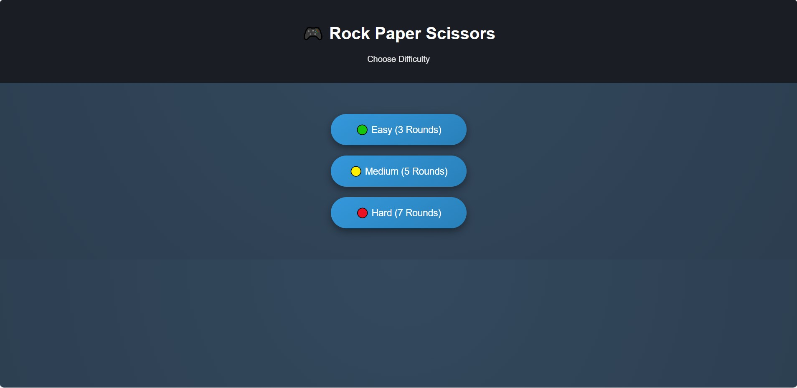
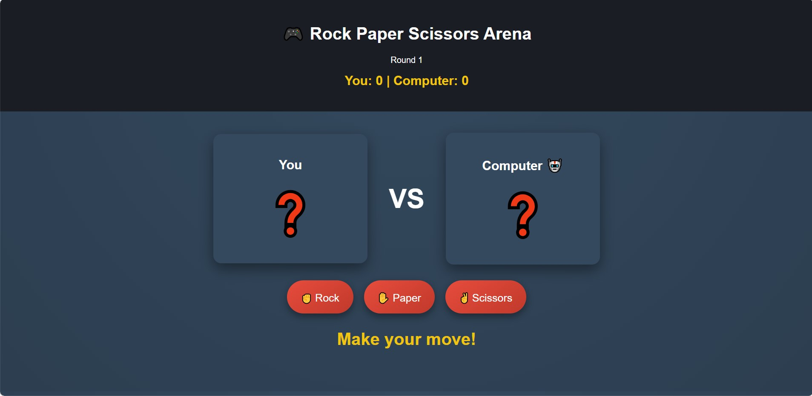
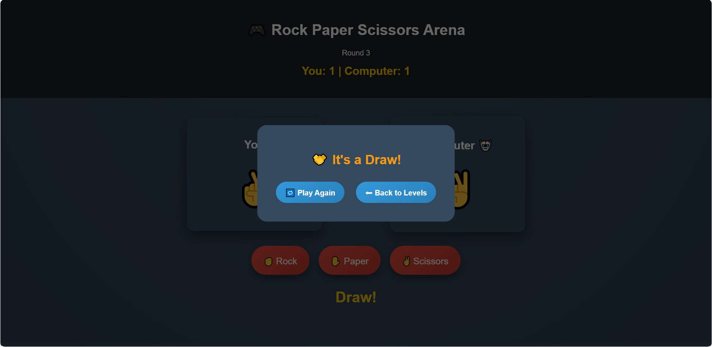

# Rock–Paper–Scissors Arcade Game
**Author:** Bonaobra Angela 
**Course:** DC 101 – Web Development 
**Project Title:** Rock-Paper-Scissors  
**Mode:** Individual Work 

## Game Description

This Rock–Paper–Scissors game is a browser-based interactive application inspired by the classic game. Players compete against a computer opponent by selecting Rock, Paper, or Scissors. The game features:

1. Round-based scoring system with multiple difficulty levels (Easy, Medium, Hard)
2. Real-time score tracking
3. Popup result screen at the end of each match
4. Optional sound effects for clicks, wins, losses, and draws

The project demonstrates DOM manipulation, event handling, game logic implementation, and interactive UI design using HTML, CSS, and JavaScript.

## Technologies Used
This project was built using pure front-end technologies:
- **HTML** – Structure of the game
- **CSS** – Styling, responsive design, and visual feedback
- **JavaScript** – Game logic, scoring, event handling, and popup management
- **Git & GitHub** – Version control and project hosting

## How to Play

1. Open the game in a web browser.
2. Select a difficulty level: Easy (3 rounds), Medium (5 rounds), or Hard (7 rounds).
3. Click on Rock ✊, Paper ✋, or Scissors ✌️ to make your move.
4. The computer will randomly select its move after a short delay.
5. Scores are updated after every round.
6. After all rounds are completed, a result popup displays the final winner.
7. Use Play Again to restart the same difficulty or Back to Levels to choose a new difficulty.

## How to Run the Game

Option 1: Play Online (GitHub Pages)

You can play the game anytime through the live link below:
🔗https://carenjavier328-hue.github.io/DC101_Game_BonaobraAngela/

Option 2: Run Locally on Your Computer

## Download or clone the repository:
git clone https://github.com/angelalacerna01-bot/DC101_Game_BonaobraAngela

Open the project folder.
Double-click index.html to open it in your browser.

Start playing!

## Screenshots
### Levels

### Gameplay

### Result

## References

- Google Fonts – Arial – used for basic font styling
Source: https://fonts.google.com

- Sound Effects – Click, Win, Lose, Draw sounds included in assets folder

- Inspired by classic Rock–Paper–Scissors game mechanics